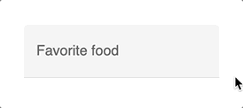

# CSS Only Material Input


<p align="center">
<a href="https://github.com/daFant/css-only-material-input/blob/main/LICENSE"></a><br/><br/>

CSS only material looking input elements without JavaScript.
</p>

## Preview




## Usage

1. [Download](https://raw.githubusercontent.com/daFant/css-only-material-input/main/src/material-input.css) and include the CSS in the `<head>` of your website:
```html
<link href="css/material-input.css" rel="stylesheet">
```

2. The `<input>` elements must be placed in a container element with the class `mat-input`. The corresponding `<label>` must be inserted **after the input** element.

 ```html
<div class="mat-input">
    <input id="food" type="text" placeholder="Ex. Pizza">
    <label for="food">Favorite food</label>
</div>
 ```
Note: The `<input>` element must have a `placeholder` attribute to work properly. If you don't want to display a `placeholder` string, use a space (`placeholder=" "`).